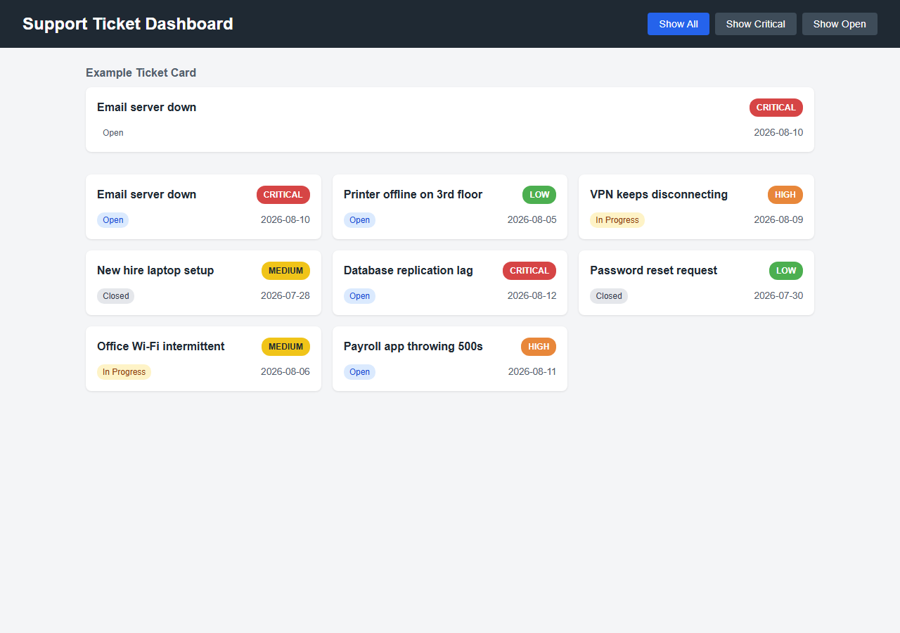
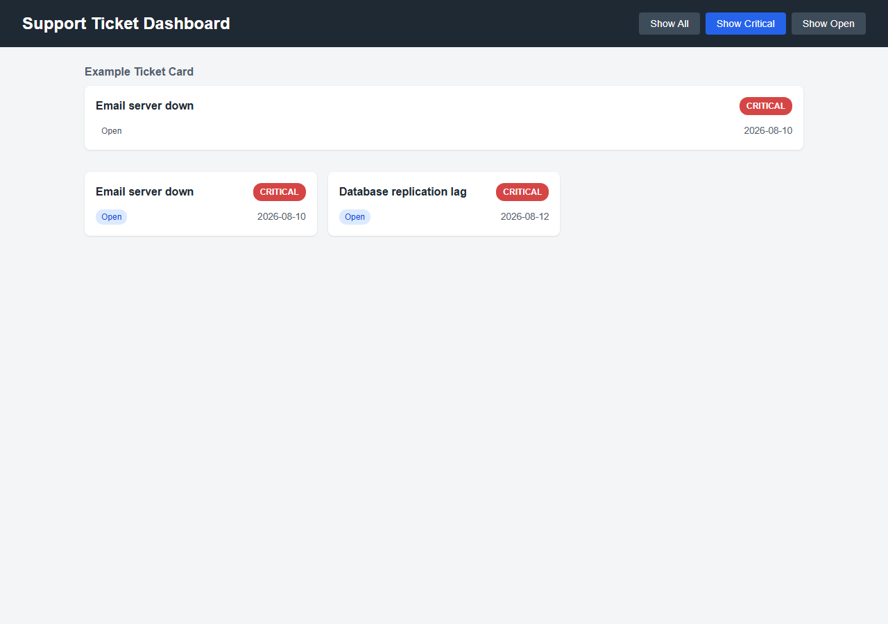
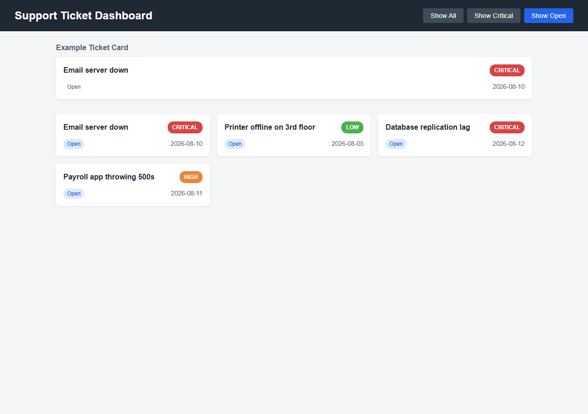

# Support Ticket Dashboard — Take-Home Exercise

## The Scenario

You're stepping into a project left behind by a junior developer who was
abruptly moved to another team. This dashboard is used by IT to view,
filter, and prioritize support tickets. The UI is incomplete, the buttons
don't work, and the core backend logic for organizing tickets is broken.

Your job: follow the `// TODO:` comments across the project files to fix
the backend logic, wire up the frontend controls, and complete the styling.

## The Goal

This is what the finished dashboard looks like and does. Use these as your
reference — you're rebuilding this behavior.

**Default view — all 8 tickets, laid out in a responsive grid:**



**"Show Critical" — filtered to only Critical-priority tickets, button highlighted active:**



**"Show Open" — filtered to only Open tickets:**



## Rules

- **Time limit: 2.5 hours**, starting once you've finished Phase 0 below
  (repo cloned, your branch created, `dotnet run` confirmed working). Getting
  set up doesn't count against your time. Roughly 90 minutes backend, 60
  minutes frontend from there — the backend is the harder, more
  heavily-weighted half of this exercise.
- **No internet access, except GitHub for this repository.** You may use
  `git clone` / `git push` against the assessment repo (see Phase 0) —
  nothing else online. No searching, no documentation sites, no AI tools,
  no browsing other repos.
- **No installs.** Don't run `npm install`, `dotnet add package`, or add any
  dependencies — you're only editing the files that already exist.
- You have VS Code and nothing else. That's all you need.
- Search the project for `TODO` to find every place you need to make a change.
- Not every bug in this project is marked with a `TODO` — see Phase 1 below.
- **This is a shared repository.** Every candidate branches off the same
  repo, so other candidates' branches are technically visible to you once
  they're pushed. Do not open, read, or copy from another candidate's
  branch — doing so disqualifies your submission.

## Phase 0 — Get Set Up (untimed, do this first)

Do this before starting your 2.5-hour timer. None of it is being scored —
it just gets you to a working starting point.

1. Open a terminal (in VS Code: **Terminal → New Terminal**).

2. Check git is installed:
   ```
   git --version
   ```
   If that errors instead of printing a version number, ask a proctor
   before continuing.

3. Clone the repository:
   ```
   git clone <REPO_URL>
   cd <REPO_FOLDER_NAME>
   ```

4. If you've never used git on this machine before, set your identity
   (skip this if you already know it's configured):
   ```
   git config --global user.name "Your Name"
   git config --global user.email "you@example.com"
   ```

5. Create your own branch, named after you — first name, underscore, last
   name (replace any spaces or hyphens in your name with underscores too),
   e.g. `Jane_Doe`:
   ```
   git checkout -b Jane_Doe
   ```
   Replace `Jane_Doe` with your own name. Then confirm you're actually on
   it:
   ```
   git branch
   ```
   The line with a `*` next to it is your current branch — make sure it's
   yours, not `main`.

6. Confirm the project runs, so you know your machine is good before the
   clock starts:
   ```
   cd Backend
   dotnet run
   cd ..
   ```

7. **Start your 2.5-hour timer now.** Everything from here on (Phases 1–3)
   is timed.

8. While you work, save your progress as often as you like:
   ```
   git add .
   git commit -m "describe what you changed"
   ```

9. When you're done (or time is up), push your branch:
   ```
   git push -u origin Jane_Doe
   ```
   (Replace `Jane_Doe` with your branch name. You only need `-u origin
   Jane_Doe` the first time — after that, plain `git push` is enough.) If
   this fails saying the branch already exists on the remote, someone else
   has the same name — append today's date and push again, e.g.
   `git push -u origin Jane_Doe_20260814`.

10. Tell your proctor/interviewer once you've pushed — that's your
    submission. Only ever push to your own branch; never push to `main`.

## How to check your work

- **Backend:** open a terminal in the `Backend` folder and run:
  ```
  dotnet run
  ```
  This prints the output of every `TicketManager` method. Compare it against
  what the method's job should be (see the comments above each method in
  `TicketManager.cs`).
- **Frontend:** open `Frontend/index.html` directly in a browser (double-click
  it, or use VS Code's "Open with Live Server" / "Reveal in File Explorer").
  No server needs to be running — it's a static page. Open the browser's
  DevTools console (F12) too — several `script.js` functions aren't wired to
  any button and are only checked by comparing their logged output against
  the comment above each function, the same way you check the backend.

## Checklist

### Phase 1 — C# Backend (`Backend/TicketManager.cs`)

**Warm-up**

- [ ] `GetHighPriorityTickets()` returns only tickets with `PriorityLevel`
      `"Critical"` or `"High"`
- [ ] `SortTicketsByDate()` returns the tickets sorted newest → oldest by
      `CreatedDate`

**Core**

- [ ] `GetAllTickets()` returns a defensive copy — a caller mutating the
      returned list must not affect `TicketManager`'s internal state
- [ ] `GetTicketCountsByStatus()` returns a `Dictionary<string, int>` with
      the correct count of tickets per status (`Open`, `In Progress`,
      `Closed`), implemented with LINQ rather than a manual loop
- [ ] `SortTicketsByPriorityThenDate()` orders tickets by urgency
      (`Critical` → `High` → `Medium` → `Low`), then by newest `CreatedDate`
      within the same priority
- [ ] `GetAverageResolutionDays()` returns the average days between
      `CreatedDate` and `ClosedDate` across closed tickets only, and returns
      `0` (not a crash) when there are none
- [ ] `GetTicketsByAssignee(assignee)` matches `AssignedTo` case-insensitively,
      and treats `null`/empty input as "give me the unassigned tickets"
- [ ] `SearchTickets(keyword)` matches the keyword case-insensitively against
      a ticket's `Title`, `Tags`, and `Comments`

**Reasoning**

- [ ] `GetSlaBreaches(asOf)` returns unresolved tickets whose age
      (`asOf - CreatedDate`) exceeds their priority's SLA threshold
      (`SlaThresholds`); Closed tickets never breach, no matter how old
- [ ] `GetEscalatedTickets(asOf)` returns **new** ticket copies for every
      SLA-breaching ticket, with priority bumped one step more urgent
      using `PriorityOrder` (Critical stays Critical) — the originals in
      `_tickets` must be untouched

**Debug it**

- [ ] `GetUnresolvedTickets()` is fully implemented but returns the wrong
      tickets — find the bug (compare its output against its doc comment)
      and fix it without rewriting the method

### Phase 2 — HTML & CSS (`Frontend/index.html`, `Frontend/style.css`)

- [ ] The page loads completely unstyled and completely non-interactive:
      add the missing `<link>` tag (in `<head>`) so `style.css` is applied,
      and the missing `<script>` tag so `script.js` runs. Think about where
      the script tag needs to go — it looks up elements like
      `#ticket-container` as soon as it runs
- [ ] The "Example Ticket Card" in `index.html` has the classes it needs
      (check `style.css` for the class names it expects) so it renders
      styled like a real ticket card
- [ ] The header lays out the title and filter buttons in a row, not stacked
      (`.dashboard-header`, `.filter-panel` in `style.css`)
- [ ] The ticket list below the example card lays out as a responsive
      multi-column grid, not a single stacked column (`.ticket-grid` in
      `style.css`)
- [ ] `.badge-critical`, `.badge-high`, `.badge-medium`, `.badge-low` each
      have a background color and text color that make sense for their
      urgency (critical = most urgent, low = least)

### Phase 3 — JavaScript (`Frontend/script.js`)

**Warm-up**

- [ ] `renderTickets()` builds a ticket card for each ticket and appends it
      to the `#ticket-container` element (match the structure of the
      Example Ticket Card)
- [ ] Each rendered card's badge and status get the correct CSS class
      based on the ticket's `priorityLevel` and `status` (use the
      `getBadgeClass()` / `getStatusClass()` helpers already provided)
- [ ] The three filter buttons (`Show All`, `Show Critical`, `Show Open`)
      are wired up with click listeners so they actually filter the list

**Core** (verify these via the browser console — see "How to check your work")

- [ ] `getTicketCountsByStatus(tickets)` returns a plain object with the
      correct count of tickets per status, implemented with `reduce()`
      rather than a manual loop
- [ ] `sortTicketsByPriorityThenDate(tickets)` returns a **new** array
      ordered by urgency (`Critical` → `High` → `Medium` → `Low`), then by
      newest `createdDate` within the same priority
- [ ] `getAverageResolutionDays(tickets)` returns the average days between
      `createdDate` and `closedDate` across closed tickets only, and
      returns `0` (not `NaN`) when there are none
- [ ] `getTicketsByAssignee(tickets, assignee)` matches `assignedTo`
      case-insensitively, and treats `null`/empty input as "give me the
      unassigned tickets"
- [ ] `searchTickets(tickets, keyword)` matches the keyword
      case-insensitively against a ticket's `title`, `tags`, and `comments`

**Debug it**

- [ ] `getTicketsSortedByDate(tickets)` is fully implemented but has a bug:
      calling it permanently reorders the shared `tickets` array instead of
      only returning a sorted copy. Find the line responsible and fix it
      without rewriting the function

## Done?

When your dashboard matches the screenshots above and every checklist item
is checked, you're done. Good luck.
